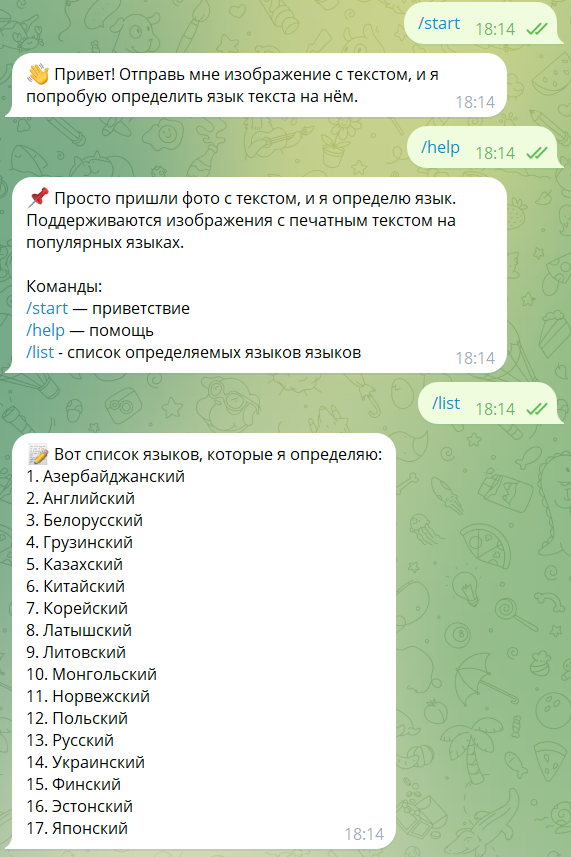
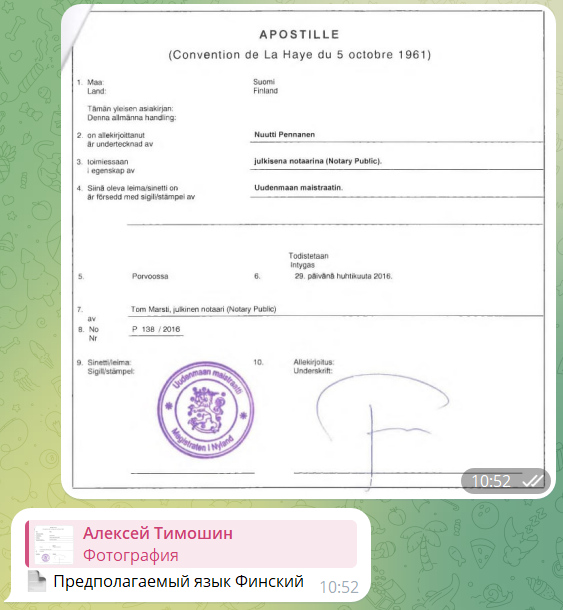
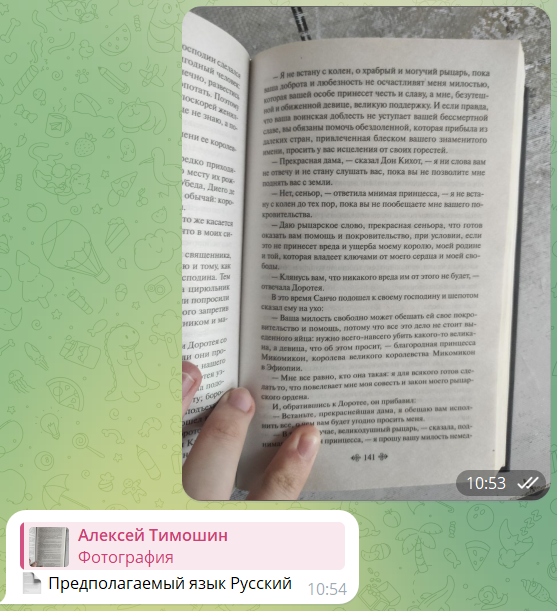

# 🤖 OCR Language Classifier — Telegram Bot


A modular, Dockerized Telegram bot for OCR-based document text extraction and language identification.  
Built with **MMOCR (TextSnake)**, **Tesseract**, and **FastText**, this system leverages both computer vision and natural language processing.

---

## ✨ Features

✅ Extracts text from user-submitted **images**  
✅ Performs **language detection** using FastText (176+ languages)  
✅ Uses **MMOCR** for text detection and **Tesseract** for OCR  
✅ Fully **Dockerized** with Miniconda  
✅ Async **Telegram bot** built with Aiogram  
✅ Easily extendable and open-source

---

## 🗂 Project Structure

```
ocr-documents-system/
├── bot/
│   ├── handler/
│   │   ├── commands.py       # /start, /help, /list handlers
│   │   └── image.py          # Image recognition handler
│   ├── config.py             # Bot configuration (Telegram token)
│   ├── logger.py             # Logging setup
│   └── main.py               # Bot startup entry point
│
├── ocr_engine/
│   ├── classifier.py         # FastText-based language classifier
│   ├── config.py             # OCRConfig dataclass for paths
│   ├── engine.py             # Main OCREngine pipeline (TextSnake + Tesseract)
│   ├── lang_map.py           # Mapping language code → name (Russian)
│   └── utils.py              # Helper functions & language list
│
├── data/
│   ├── models/               # FastText `.bin` model
│   └── tessdata/             # Tesseract language files
│
├── .env                      # Environment variables
├── Dockerfile                # Conda-based Docker build
├── .dockerignore             # Ignoring unnecessary local files
├── .gitignore                # Standard exclusions + /data
└── README.md                 # You're reading it
```

---

## 🖼️ Demo Screenshots

### 💬 Command Interface

Interact using:
- `/start`
- `/help`
- `/list`



---

### 🌍 Language Detection Examples

#### 🇫🇮 Finnish Document



#### 🇷🇺 Russian Document



---

## ⚙️ Environment Variables

Create a `.env` file in the root directory with the following values:

```env
BOT_TOKEN=your_telegram_bot_token
FASTTEXT_PATH=/ocr-documents-system/data/models/lid.176.bin
TESSDATA_PATH=/ocr-documents-system/data/tessdata
```

---

## 🐳 Running with Docker

```bash
docker build -t ocr-bot .
docker run --env-file .env ocr-bot
```

---

## 📦 Technologies

- **[MMOCR](https://github.com/open-mmlab/mmocr)** (TextSnake)
- **[Tesseract OCR](https://github.com/sirfz/tesserocr)** (tesserocr wrapper)
- **[FastText](https://fasttext.cc/)** for language prediction
- **[Aiogram](https://github.com/aiogram/aiogram)** Telegram bot framework
- **Docker** + **Miniconda** for reproducible environments

---

## 🧪 Example Output

**Input:** Scanned image of a document  
**Output:**
- Extracted text
- Predicted language
- Inline message in Telegram

---

## 📜 License

This project is licensed under the **MIT License**.

---

## ✉ Contact

🐙 **GitHub**: [AlekseyScorpi](https://github.com/AlekseyScorpi)  
📬 For questions or collaborations — feel free to reach out via GitHub Issues or Pull Requests.
